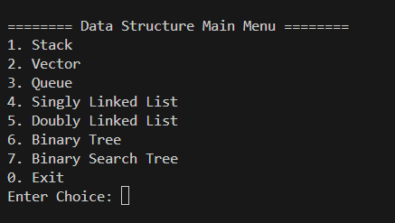
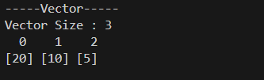
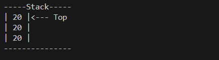
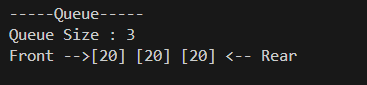
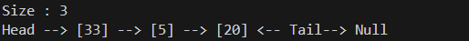
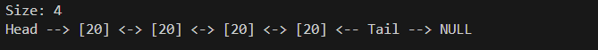
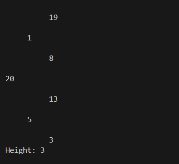
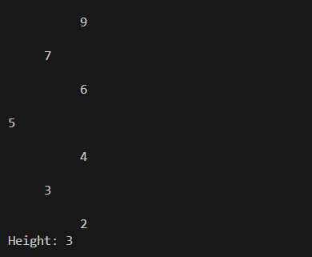

# Visualizing Data Structures

>This project is a console program written in C++ that simulates and visually displays data structures.

>It allows you to perform common operations and see results in a clean text format.

This project manually implements the following data structures (without using STL, except in very limited cases for tree implementation):

1. **Stack**
    - Operations: `push()`, `pop()`, `display()`

2. **Vector (Dynamic Array)**
    - Operations: `push_back()`, `pop_back()`, `display()`

3. **Queue**
    - Operations: `enqueue()`, `dequeue()`, `display()`

4. **Singly Linked List**
    - Operations: insert at front, insert at end, delete by value, display

5. **Doubly Linked List**
    - Operations: insert at front, insert at end, delete by value, display

6. **Binary Tree**
    - Operations: insert, delete, display (side-view text visualization)

7. **Binary Search Tree (BST)**
    - Operations: insert, delete, display (side-view text visualization)

>Screen shots :

1. Main Menu  

2. Vector display :

3. Stack display : 

4. Queue display : 

5. Singly linked list : 

6. Doubly linked list : 

7. Binary Tree : 

8. Binary Search Tree : 

